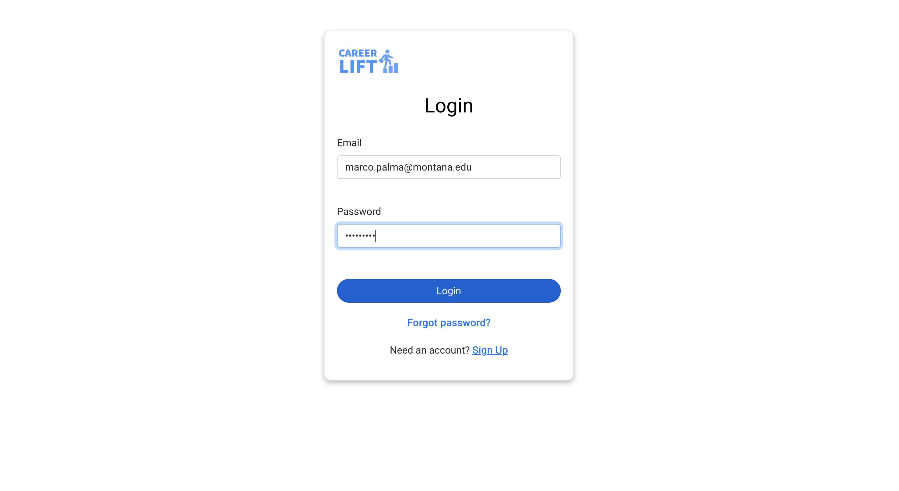
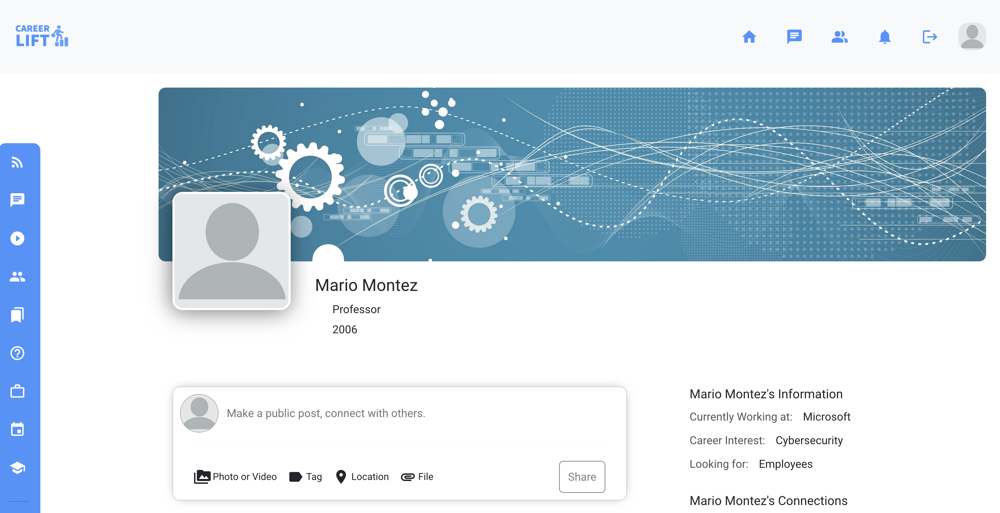

# CSCI 331 Project - CareerLift 

CareerLift is social networking platform built, using MERN stack, for students, professors, and alumni to connect, share advice, and post job opportunities.

* [App](https://careerlitz.herokuapp.com/)
* [Class presentation](presentation/csci331.pdf)
* [Project management](https://github.com/alyssanewhart/combined-app/projects/1)

